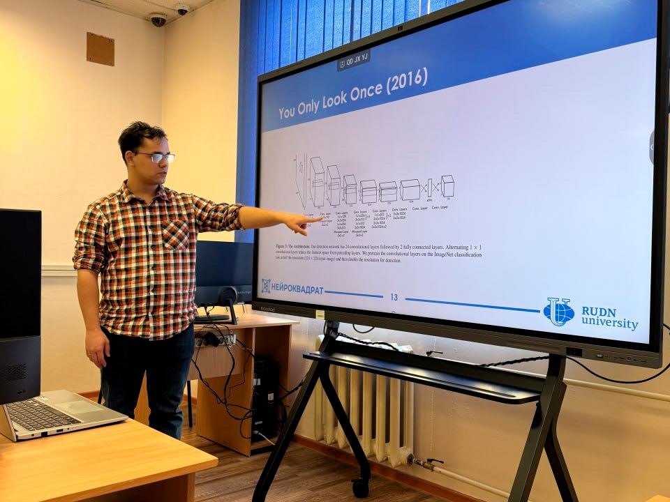

# facetechsprint-rudn
Мои материалы к FaceTechSprint RUDN

## Суть:
Трёхдневный марафон, за время которого участники с нуля изучают нейросети и computer vision. Я вёл его вместе со своим научным руководителем, и в этом репозитории собраны лекции и практика иоего авторства.

